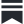
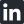

# I'm Kevin

Solo founder building dark startups using [Alembiq](https://alembiq.app) and [AgenC](https://github.com/mieubrisse/agenc), just AI and I.

<a href="https://kevintoday.com" title="Website"><picture><source media="(prefers-color-scheme: dark)" srcset="icons/globe.svg"><source media="(prefers-color-scheme: light)" srcset="icons/globe-dark.svg"></picture></a>&nbsp;&nbsp;&nbsp;
<a href="https://mieubrisse.substack.com/" title="Substack"><picture><source media="(prefers-color-scheme: dark)" srcset="icons/substack.svg"><source media="(prefers-color-scheme: light)" srcset="icons/substack-dark.svg"></picture></a>&nbsp;&nbsp;&nbsp;
<a href="https://www.linkedin.com/in/kevintoday/" title="LinkedIn"><picture><source media="(prefers-color-scheme: dark)" srcset="icons/linkedin.svg"><source media="(prefers-color-scheme: light)" srcset="icons/linkedin-dark.svg"></picture></a>&nbsp;&nbsp;&nbsp;
<a href="https://x.com/kevinjtoday" title="X"><picture><source media="(prefers-color-scheme: dark)" srcset="icons/x.svg"><source media="(prefers-color-scheme: light)" srcset="icons/x-dark.svg"></picture></a>&nbsp;&nbsp;&nbsp;
<a href="https://www.instagram.com/kevinjtoday" title="Instagram"><picture><source media="(prefers-color-scheme: dark)" srcset="icons/instagram.svg"><source media="(prefers-color-scheme: light)" srcset="icons/instagram-dark.svg"></picture></a>

**⚗️ [Alembiq](https://alembiq.app)** - Build your own AI OS to power your solopreneur life.

**👑 [Substack Sovereign](https://substacksovereign.com/)** - Write Markdown. Push to Github. Publish to Substack.

**🚀 [AgenC](https://github.com/mieubrisse/agenc)** - Dark Startup OS. You're the CEO, the Claudes are your company. Do all your work through Claudes, and evolve them when they mess up.

**⚡ [cmdk](https://github.com/mieubrisse/cmdk)** - ⌘-K for your terminal. Fuzzy-find and open anything from the command line.

**🚫 [yappblocker](https://github.com/mieubrisse/yappblocker)** - macOS app blocker. Kill distracting apps on a schedule so you don't have to rely on willpower.

**⚙️ [go-cli-template](https://github.com/mieubrisse/go-cli-template)** - Starter template for Go CLI tools with Homebrew publishing baked in.

**🤑 [wealthdraft](https://github.com/mieubrisse/wealthdraft)** - Tax liability calculator. Predict your federal tax bill before you file.

**📚 [kindle-highlight-scraper](https://github.com/mieubrisse/kindle-highlight-scraper)** - Export all your Kindle highlights and notes as JSON. No official API, so it scrapes Amazon's highlights page.

**🍵 [teact](https://github.com/mieubrisse/teact)** - React-like component framework for the [BubbleTea](https://github.com/charmbracelet/bubbletea) TUI framework. Flexbox layout, responsive sizing, and HTML-analogous components.
